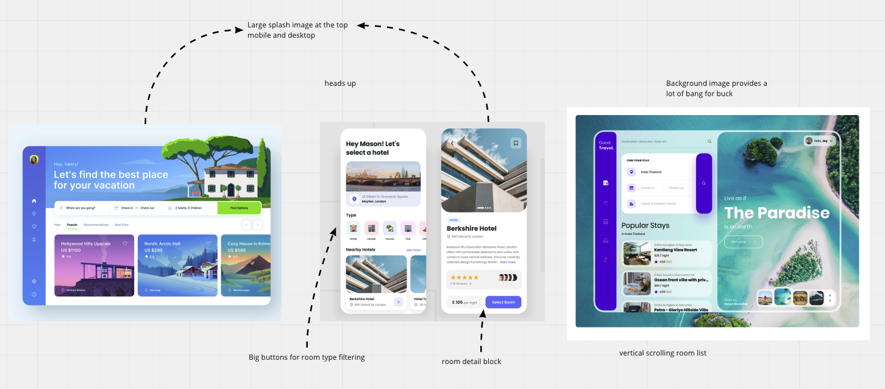
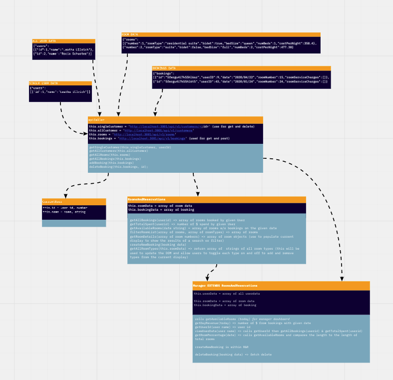
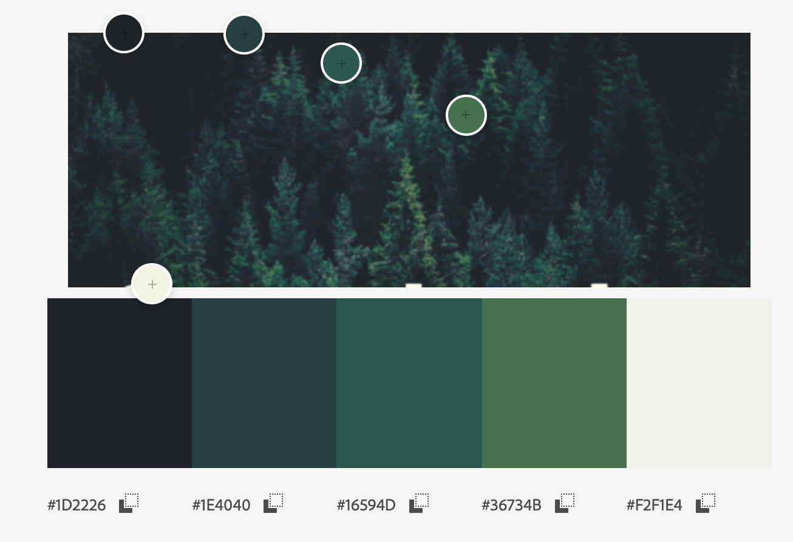

# OVERLOOK

## Contributors
* Matt Umland

## Overview
Overview is a booking app for a hotel. After a user logs in, they can review their past reservations, see their total spending and book a room. Simple filtering and a drop down date input allows users to refine their search. The app uses asynchronous JavaScript to pull date from a backend via an API. It is fully responsive for desktop, phone and tablet and uses semantic html and ARIA labels for accessibility.

##### Walkthrough

##### Responsive Design

#### Login Credentials
* **username** - There are 50 user names starting with customer1 and ending with customer50.  Any user name beginning with "customer" and ending with a 1 or 2 digit number, less than or equal to 50.    
 _(e.g. customer1, customer24, customer47)_
* **password** - overlook2021

### Reference images

### Class structure sketch

### Background image by Evgeni Evgeniev, unsplash.com

### Color palette

## Reflection
My general approach for this project was to get a lot out of a small amount of pieces. This was manifested in multiple ways in the final product:
1. A large beautiful background image, which defined the color palette and ensured the site always featured something visually engaging.
2. A small number of classes with highly flexible methods that could be deployed in multiple arrangements to meet the user stories.
3. Using SASS to create consistent card styles, colors and spacing that made adding and removing elements from the page straightforward and efficient.

## Installation and Setup
1. Clone down this repo.
2. Install dependencies in the root directory with `npm install`
3. Clone the backend api at https://github.com/turingschool-examples/overlook-api
4. Start up the backend with `npm install` then `npm start`
5. Start the client with `npm start` in the root project directory
6. Go to http://localhost:8080/ to see the app.

## Tech Stack
* Languages
  * Vanilla JS
  * HTML
  * CSS & SASS
* Web browser engine & compiler
  * Webpack
* Testing suite
  * Mocha
  * Chai
* Project management tool
  * Trello - kanban board
  * Miro whiteboard - mapping out program architecture

## Future Iterations
 * Add manager class and functionality
 * Isolate scrolling to only include the booking list in desktop view
 * Add a logo to the header bar
 * Sort reservation data and dashboard by past, present (today) and future
